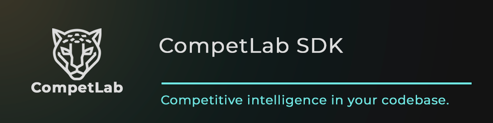

<p align="center">
  
</p>

# @competlab/sdk

[](https://www.npmjs.com/package/@competlab/sdk)
[](https://www.npmjs.com/package/@competlab/sdk)
[](https://www.typescriptlang.org/)
[](https://nodejs.org/)
[](https://opensource.org/licenses/MIT)
[](#available-resources)
[]()

> Track what ChatGPT, Claude, and Gemini say about your brand — programmatically.

40% of B2B buyers ask AI before they Google. This SDK gives you typed access to everything CompetLab monitors: AI visibility, competitor pricing, content changes, positioning shifts, and tech stack signals. 3 lines to your first insight.

## Install

```sh
npm install @competlab/sdk
```

## Quick Start

```typescript
import CompetLab from '@competlab/sdk';

const cl = new CompetLab({ apiKey: process.env.COMPETLAB_API_KEY });

// See how 3 AI systems rank your brand vs competitors
const visibility = await cl.aiVisibility.dashboard('proj_abc');
```

## What is CompetLab?

Competitive intelligence for the AI era. One platform, 5 dimensions, monitored automatically:

| Dimension | What It Tracks |
|-----------|---------------|
| **Tech & Trust** | Tech stacks, security headers, trust signals |
| **Content** | Sitemaps, content categories, publishing cadence |
| **Positioning** | Homepage messaging, value props, CTAs |
| **Pricing** | Plans, pricing models, feature comparisons |
| **AI Visibility** | How ChatGPT, Claude, and Gemini rank your brand vs competitors |

AI Visibility is what makes CompetLab unique — no other CI platform tracks how LLMs recommend brands in real time.

> [Start free trial](https://app.competlab.com/register) | [Learn more](https://competlab.com)

## Available Resources

```typescript
cl.health           // API health check
cl.projects         // List and get projects
cl.competitors      // Monitored competitors
cl.techTrust        // Tech stack & trust signals
cl.content          // Content analysis & changelog
cl.positioning      // Homepage messaging analysis
cl.pricing          // Pricing intelligence
cl.aiVisibility     // AI visibility scores & trends
cl.analysis         // AI-generated action plans
cl.alerts           // Competitive change alerts
cl.schedules        // Monitoring schedules
cl.tools            // Free tools — sitemap, AI crawlers, tech stack, trust signals, agent adoption, fetch URL
```

**12 resources. 34 methods. Zero dependencies.** Uses native `fetch` — no axios, no bloat.

## Examples

### See what AI says about you

```typescript
const { data } = await cl.aiVisibility.dashboard('proj_abc');

// data.item.summary =>
// {
//   customer: { domain: "you.com", mentionRate: 100, aiScore: 82 },
//   topCompetitor: { domain: "rival.com", mentionRate: 33 },
//   mentionRateGap: 67,
//   competitorRankings: [
//     { name: "You",   domain: "you.com",   mentionRate: 100, aiScore: 82, isOwn: true },
//     { name: "Rival", domain: "rival.com", mentionRate: 33,  aiScore: 31, isOwn: false }
//   ]
// }
```

### Track how your AI ranking changes over time

```typescript
const trend = await cl.aiVisibility.trend('proj_abc', {
  provider: 'openai'
});
// Weekly snapshots of your visibility score — spot drops before they cost you deals
```

### Get a competitive action plan

```typescript
const plan = await cl.analysis.actionPlan('proj_abc');
// AI-generated priorities across all 5 dimensions:
// "Your competitor added 3 trust badges you're missing — here's which ones matter"
```

### Catch competitor pricing changes

```typescript
const alerts = await cl.alerts.list('proj_abc', {
  dimension: 'pricing',
  severity: 'critical'
});
// Know the moment a competitor changes pricing — not weeks later from a churned customer
```

### Compare competitor tech stacks

```typescript
const tech = await cl.techTrust.dashboard('proj_abc');
// Security headers, frameworks, CDNs, analytics tools — across all monitored competitors
```

### Free tools — no project required

Stateless utilities that work on any public domain. Sync tools return immediately; the three async scans (`techStack`, `trustSignals`, `agentAdoption`) return a `scanId` you poll until `status` is `completed` or `failed` (24h TTL).

```typescript
// Sync
const sitemap = await cl.tools.sitemapVisualizer({ domain: 'example.com' });
const crawlers = await cl.tools.aiCrawlerChecker({ domain: 'example.com' });

// Fetch any URL with JS-rendering + bot-protection handling
const page = await cl.tools.fetchUrl({ url: 'https://example.com', cleanHtml: true });

// Async — start a scan, poll until done
const { data } = await cl.tools.techStack.startScan({ domain: 'example.com' });
const scanId = data!.item.id;

let result;
while (true) {
  const polled = await cl.tools.techStack.getScan(scanId);
  if (polled.data!.item.status === 'completed') { result = polled.data!.item.result; break; }
  if (polled.data!.item.status === 'failed') throw new Error(polled.data!.item.error?.code);
  await new Promise((r) => setTimeout(r, 3000));
}
```

Same shape applies to `cl.tools.trustSignals.{startScan,getScan}` and `cl.tools.agentAdoption.{startScan,getScan}`.

## MCP Server

Prefer AI-native access? CompetLab also offers an MCP server with 32 tools — connect Claude Code, Cursor, or VS Code directly.

> [competlab.com/developers/mcp](https://competlab.com/developers/mcp)

## API Reference

Full interactive API documentation with "Try It" panel:

> [competlab.com/developers/api](https://competlab.com/developers/api)

## Requirements

- Node.js 20+
- CompetLab API key ([start free trial](https://app.competlab.com/register) — 14 days, no credit card)

## Troubleshooting

| Issue | Fix |
|-------|-----|
| `api_key_missing` error | Ensure you're passing the key via `apiKey` option or `COMPETLAB_API_KEY` env var |
| `api_key_invalid` error | Keys must start with `cl_live_` and be exactly 40 characters |
| `fetch is not defined` | Requires Node.js 20+ (uses native `fetch`) |
| TypeScript type errors after update | Run `npm install @competlab/sdk@latest` and restart your TS server |

## Links

- [REST API Reference](https://competlab.com/developers/api)
- [MCP Server](https://competlab.com/developers/mcp) (AI-native access with 32 tools)
- [GitHub — MCP Server](https://github.com/competlab/competlab-mcp-server)
- [Privacy Policy](https://competlab.com/privacy-policy)
- [Start Free Trial](https://app.competlab.com/register)

## Support

- Bug reports: [GitHub Issues](https://github.com/competlab/competlab-sdk/issues)
- Email: [support@competlab.com](mailto:support@competlab.com)
- Documentation: [competlab.com/developers](https://competlab.com/developers/api)

## License

MIT — see [LICENSE](./LICENSE)

---

Built by the [CompetLab](https://competlab.com) team. Competitive intelligence for the AI era.

[](https://x.com/intent/tweet?text=TypeScript%20SDK%20for%20competitive%20intelligence%20%E2%80%94%20track%20what%20ChatGPT%20says%20about%20your%20brand&url=https://github.com/competlab/competlab-sdk)
[](https://www.linkedin.com/sharing/share-offsite/?url=https://github.com/competlab/competlab-sdk)
